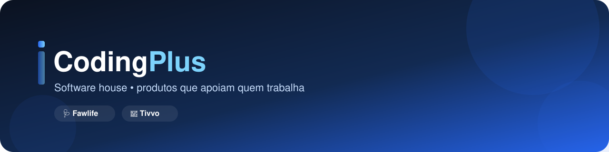

### Construímos software que fica no bastidor do trabalho de outras pessoas —
### e faz esse trabalho ficar mais simples.

 

 

## 👋 Quem somos

A **CodingPlus** é uma software house criada para dar apoio técnico a produtos
digitais do dia a dia — sistemas que precisam ser confiáveis, simples de usar
e feitos para durar, não só para o lançamento.

Em vez de ser uma consultoria genérica, atuamos como um **time de tecnologia
dedicado** a um portfólio pequeno de produtos próprios, cuidando de arquitetura,
segurança, infraestrutura e evolução contínua de cada um deles.

 

## 🚀 Produtos que apoiamos

<table>
  <tr>
    <td width="50%" valign="top">
      <h3>🩺 Fawlife</h3>
      

        Plataforma de gestão para profissionais e clínicas da área da saúde —
        agenda, cadastro de pacientes, cobrança e financeiro em um só lugar,
        multi-tenant desde o primeiro dia.
      

      

        
      

      <ul>
        <li>Arquitetura de microsserviços (API Gateway + serviços por domínio)</li>
        <li>Autenticação e onboarding completo (perfil profissional + loja/clínica)</li>
        <li>Agenda, disponibilidade e agendamento de consultas</li>
      </ul>
    </td>
    <td width="50%" valign="top">
      <h3>🛒 Tivvo</h3>
      

        Sistema de gestão de caixas (PDV) para supermercados — pensado para o
        dia a dia do operador de caixa, com o mínimo de fricção possível.
      

      

        
      

      <ul>
        <li>Frente de caixa (PDV) rápida e confiável</li>
        <li>Controle de vendas e fechamento de caixa</li>
        <li>Integração com o fluxo de estoque do supermercado</li>
      </ul>
    </td>
  </tr>
</table>

 

## 🛠️ Como construímos

Cada produto é dividido em **microsserviços independentes**, um repositório
por serviço, com um API Gateway cuidando da porta de entrada. Isso deixa cada
time (ou cada dev) livre para evoluir uma parte do sistema sem travar as
outras — e permite escalar só o que realmente precisa escalar.

Alguns princípios que seguimos em todos os projetos:

- **Segurança não é etapa final.** Toda mudança passa por revisão de
  segurança (com apoio de IA) antes de chegar em produção.
- **Testes automatizados de verdade.** Unitários e de integração rodando em
  CI a cada push, não só "quando dá tempo".
- **Infraestrutura como produto.** Ambientes reproduzíveis (Docker), deploy
  documentado e observável, sem "só funciona na minha máquina".
- **Git com fluxo claro.** Uma branch pessoal por dev → integração →
  produção, sempre via *pull request* revisado.

 

## 📂 Como nossos repositórios são organizados

Não usamos monorepo. Cada serviço/produto vive no seu próprio repositório,
com seu próprio ciclo de deploy e versionamento — a documentação de
arquitetura de cada produto explica o motivo dessa escolha e como os serviços
conversam entre si.

 

**CodingPlus** — construindo com cuidado, um produto de cada vez. 💚

